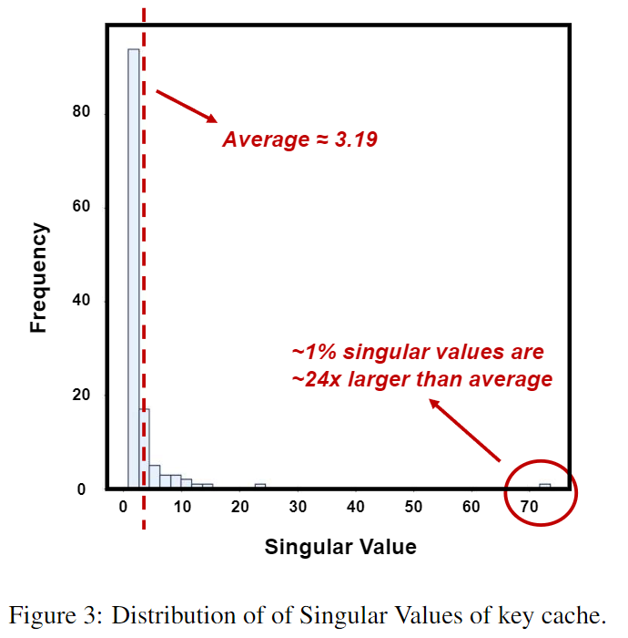
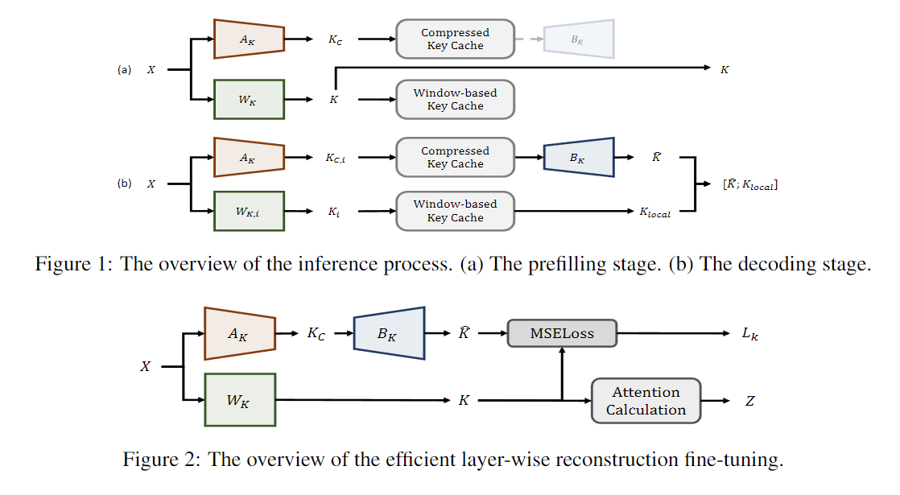

# CSKV: Training-Efficient Channel Shrinking for KV Cache in Long-Context Scenarios
> *Luning Wang, Shiyao Li, Xuefei Ning, Zhihang Yuan, Shengen Yan, Guohao Dai, Yu Wang*



## Abstract [[paper]](https://arxiv.org/abs/2409.10593)

Large Language Models (LLMs) have been widely adopted to process long-context tasks.
However, the large memory overhead of the key-value (KV) cache poses significant challenges in long-context scenarios.
Existing training-free KV cache compression methods typically focus on quantization and token pruning, which have compression limits, and excessive sparsity can lead to severe performance degradation.
Other methods design new architectures with le
ss KV overhead but require significant training overhead.
To address the above two drawbacks, we further explore the redundancy in the channel dimension and apply an architecture-level design with minor training costs.
Therefore, we introduce **CSKV**, a training-efficient **C**hannel **S**hrinking technique for **KV** cache compression:
(1) We first analyze the singular value distribution of the KV cache, revealing significant redundancy and compression potential along the channel dimension.
Based on this observation, we propose using low-rank decomposition for key and value layers and storing the low-dimension features.
(2) To preserve model performance, we introduce a bi-branch KV cache, including a window-based full-precision KV cache and a low-precision compressed KV cache.
(3) To reduce the training costs, we minimize the layer-wise reconstruction loss for the compressed KV cache instead of retraining the entire LLMs.
Extensive experiments show that **CSKV** can reduce the memory overhead of the KV cache by 80% while maintaining the model's long-context capability.
Moreover, we show that our method can be seamlessly combined with quantization to further reduce the memory overhead, achieving a compression ratio of up to 95%.


## Setup

Run the following commands to install required packages:
```bash
conda create -n cskv python==3.9
conda activate cskv
pip install -e .
```
If you intend to use the flash-attention implementation, please install [flash_attn](https://github.com/Dao-AILab/flash-attention) according to the official guidance.

In the following sections, we would use `longchat-7b-v1.5-32k` as an example to show the usage of this repo.

## Fine-tune
First generate the required clibration statistics of ASVD: 
```bash
cd cskv_src/scripts
python asvd_init_calib.py --model_path lmsys/longchat-7b-v1.5-32k --model_id longchat-7b-v1.5-32k 
```
Main arguments:
- `--model_path`: The path to the model checkpoints or model name on Huggingface.
- `--model_id`: The name you give to the model, used for result saving.
  
The generated data would be saved in `../data/asvd_data/asvd_init_ckpts/{model_id}/` by default.

Then start fine-tuning:
```bash
python train.py --model_path lmsys/longchat-7b-v1.5-32k \
--model_id longchat-7b-v1.5-32k \
--k_density 0.5 \
--v_density 0.5 \
--use_asvd \
--use_window \
--q_window_size 32 \
--k_bits 16 \
--v_bits 16
```
Main arguments:
- `--model_path`: The path to the model checkpoints or model name on Huggingface.
- `--model_id`: The name you give to the model, used for result saving. Note that it should be consistent with the one specified at the previous step to correctly retrieve the ASVD statistics.
- `--k_density`: The proportion of key cache that is kept. For example, `k_density=0.4` means 60% of the original key cache is reduced.
- `--v_density`: The proportion of value cache that is kept.
- `--use_asvd`: Whether to use ASVD as the initialization method. If not specified, the script would use vanilla SVD to initialize by default.
- `--use_window`: Whether to use window-based quantization (as in KIVI) when doing QAT. If not specified, the script would use per-token quantization for both keys and values. Note that in case of full precision (no quantization), this argument would have no impact on the tuning process.
- `--q_window_size`: The window size used for window-based quantization. Default to be 32. Note that the input sequence would be automatically truncated to the multiple of `q_window_size` for QAT.
- `--k_bits`: The bitwidth of the key cache. Default to be 16 (full precision).
- `--v_bits`: The bitwidth of the value cache. Default to be 16 (full precision).
  
The checkpoint would be saved in `../data/kvcache_compressor_checkpoints/{model_id}/` by default.

For more arguments like training hyperparams, please see the script for details.

## Inference with fine-tuned model
Here we use the model with compressed KV cache to generate with the default prompt:
```bash
python demo.py --model_path lmsys/longchat-7b-v1.5-32k \
--model_id longchat-7b-v1.5-32k \
--k_density 0.5 \
--v_density 0.5 \
--use_asvd \
--use_window \
--q_window_size 32 \
--k_bits 16 \
--v_bits 16
```
The meanings of most arguments are similar to those in the fine-tuning script. 

Also, please note that we currently use simulated quantization in our script, for the algorithm-level evaluation of the method. So the observed reduction of memory overhead with this script should not reflect the thoretical outcome. We plan to do system-level optimizations in the future.

## Citation
```
@misc{wang2024cskvtrainingefficientchannelshrinking,
      title={CSKV: Training-Efficient Channel Shrinking for KV Cache in Long-Context Scenarios}, 
      author={Luning Wang and Shiyao Li and Xuefei Ning and Zhihang Yuan and Shengen Yan and Guohao Dai and Yu Wang},
      year={2024},
      eprint={2409.10593},
      archivePrefix={arXiv},
      primaryClass={cs.LG},
      url={https://arxiv.org/abs/2409.10593}, 
}
```

